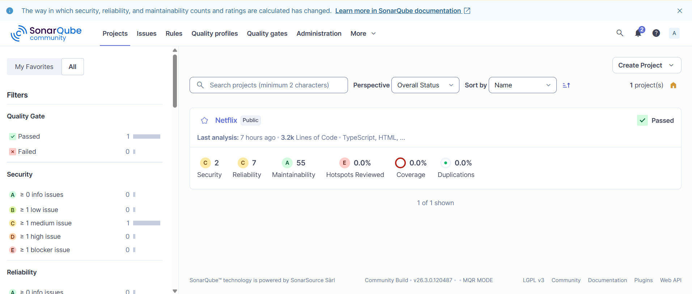
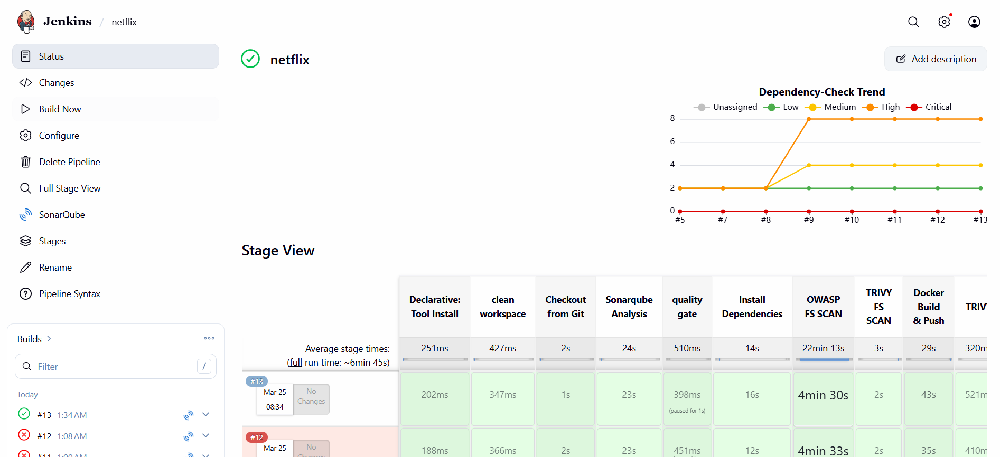
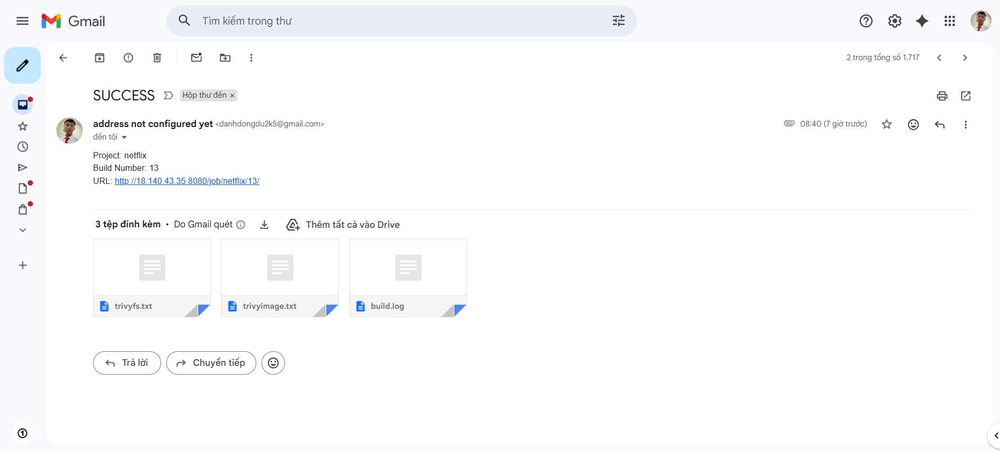
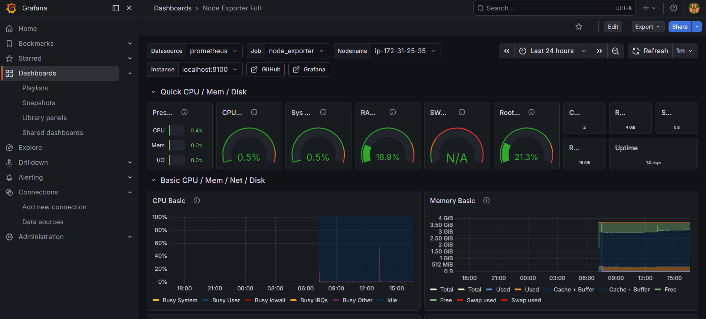
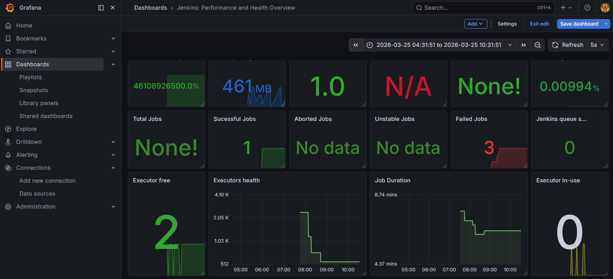
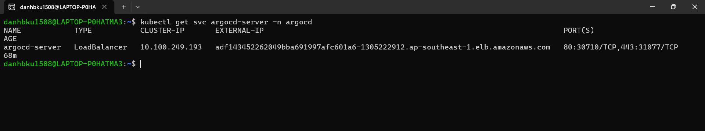
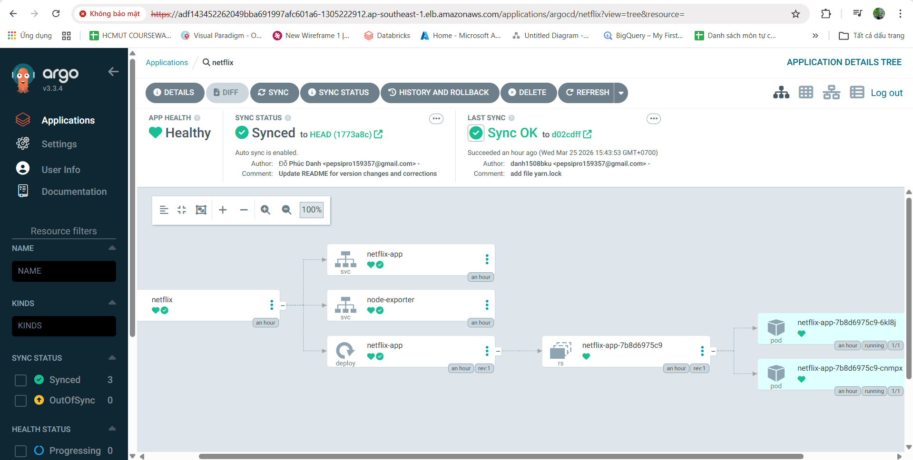
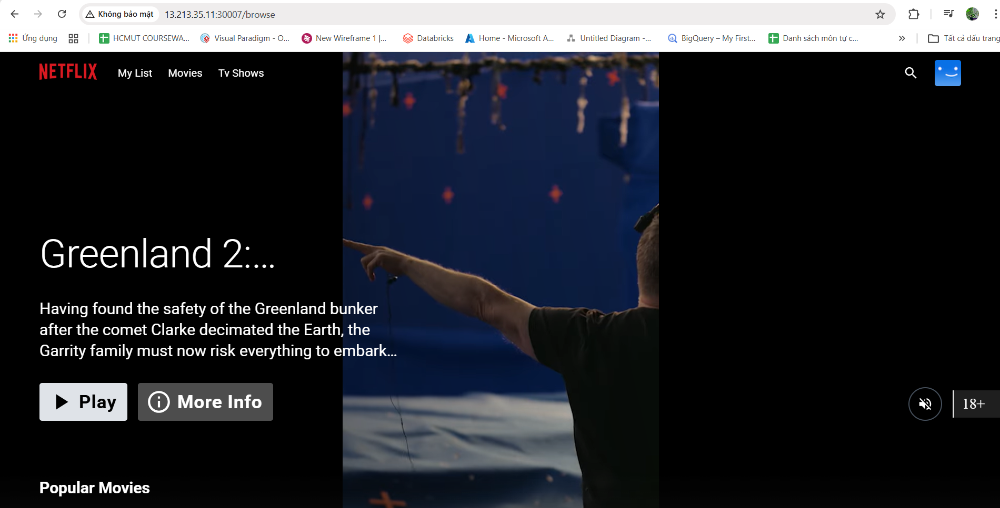

<div align="center">

# 🎬 Netflix Clone — DevSecOps CI/CD Pipeline on AWS

**End-to-end DevSecOps project deploying a containerized React application on AWS using a fully automated, security-integrated CI/CD pipeline with real-time monitoring.**

[](http://netflix-clone-with-tmdb-using-react-mui.vercel.app/)


</div>

---

## 📌 Project Overview

This project demonstrates a production-grade DevSecOps workflow for a React-based Netflix clone. The focus is on automating the full software delivery lifecycle — from code commit to deployment — while embedding security scanning at every stage. The application is deployed on AWS EKS and managed via GitOps using ArgoCD.

---

## 🏗️ Architecture


The pipeline is structured across 7 phases:

| Phase | Scope |
|---|---|
| 1 | Infrastructure provisioning & containerization on AWS EC2 |
| 2 | Static code analysis & vulnerability scanning (SonarQube + Trivy) |
| 3 | Automated CI/CD pipeline via Jenkins |
| 4 | Infrastructure monitoring with Prometheus + Grafana |
| 5 | Email notification on pipeline events |
| 6 | Kubernetes deployment on EKS with ArgoCD (GitOps) |

---

## 🛠️ Tech Stack

**Cloud & Infrastructure**
AWS EC2 · AWS EKS · Ubuntu 22.04

**CI/CD**
Jenkins · Docker · DockerHub · ArgoCD

**Security**
SonarQube · Trivy · OWASP Dependency-Check

**Monitoring & Observability**
Prometheus · Grafana · Node Exporter

**Application**
React · Node.js 16 · TMDB API

---

## 🔐 Security Integration

Security is embedded at multiple stages rather than bolted on at the end:

- **Static Analysis** — SonarQube scans source code for bugs, code smells, and security hotspots on every pipeline run.
- **Container Scanning** — Trivy performs image vulnerability scanning before any image is pushed to DockerHub.
- **Dependency Audit** — OWASP Dependency-Check flags known CVEs in third-party libraries.


*SonarQube dashboard showing code quality gates*

---

## ⚙️ CI/CD Pipeline (Jenkins)

The Jenkins pipeline automates the full build-scan-push-deploy cycle:

```
Checkout → Code Analysis (SonarQube) → Dependency Check (OWASP)
  → Docker Build → Image Scan (Trivy) → Push to DockerHub
    → Deploy to Kubernetes → Email Notification
```


*Jenkins pipeline — all stages passing*


*Email notification*

**Design decisions worth noting:**

- **Security gates are non-blocking by design in this project** — SonarQube and OWASP checks run early in the pipeline to surface issues fast, but the pipeline continues to deployment to demonstrate the full flow. In a real production setup, a failed quality gate would halt the pipeline before the build stage.
- **Trivy scans the built image, not the Dockerfile** — scanning after `docker build` catches vulnerabilities in the final layer state (base image + installed packages), which a static Dockerfile linter would miss.
- **Credentials are stored in Jenkins Credential Store**, not hardcoded in the Jenkinsfile — DockerHub credentials and the TMDB API key are injected as environment variables at runtime via Jenkins secret bindings.
- **The pipeline runs on the Jenkins master node** rather than a dedicated agent, which is a known limitation for this project scope. In production, builds would be isolated to ephemeral agents to avoid polluting the controller environment.

Key Jenkins integrations: SonarQube Scanner · NodeJS · Docker Pipeline · OWASP Dependency-Check · Email Extension

---

## 📊 Monitoring Architecture (Prometheus + Grafana)



*Grafana dashboard — system metrics from Node Exporter and pipeline metrics from Jenkins*

Two independent metric sources feed into the same Prometheus instance:

| Source | Exporter | Port | What it covers |
|---|---|---|---|
| EC2 host | Node Exporter | 9100 | CPU, memory, disk, network I/O |
| Jenkins | Prometheus Plugin | 8080/prometheus | Build duration, queue length, job success rate |
| EKS nodes | Node Exporter (Helm) | 9100 | Kubernetes worker node system metrics |

Prometheus scrapes both targets on a 15-second interval via `prometheus.yml`. Grafana connects to Prometheus as a datasource and uses **dashboard ID 1860** (Node Exporter Full) for the host metrics view. This setup gives visibility into whether pipeline failures correlate with resource exhaustion on the host — something that isn't possible if you only monitor the application layer.

---

## ☸️ Kubernetes Deployment (EKS + ArgoCD)

The application runs on an AWS EKS cluster managed through ArgoCD, enabling GitOps-style continuous delivery. Any push to the deployment manifest repository triggers an automatic sync to the cluster.



*ArgoCD application in healthy, synced state*

---

## 🖥️ Application


*Netflix clone running on Kubernetes — served via NodePort on EKS*

---

## 💡 Challenges & Key Takeaways

**Docker socket permissions on EC2** — The Jenkins process needs access to `/var/run/docker.sock` to build images. Granting this correctly without running Jenkins as root required adding the `jenkins` user to the `docker` group and restarting the service, rather than using `chmod 777` (which works but is a security anti-pattern in production).

**SonarQube quality gate timing** — SonarQube analysis is asynchronous; the scanner submits the analysis and returns immediately. Without the `waitForQualityGate()` step in the Jenkinsfile, the pipeline would proceed before the gate result is available — a subtle race condition that isn't obvious from the plugin documentation.

**ArgoCD vs. Jenkins for final deployment** — Using both creates an intentional split responsibility: Jenkins owns the CI half (build, scan, push), while ArgoCD owns the CD half (sync to cluster). ArgoCD continuously reconciles cluster state against the Git manifest, so even manual `kubectl` changes get reverted automatically — something Jenkins-based `kubectl apply` cannot guarantee.

**Prometheus scrape path for Jenkins** — The Jenkins Prometheus plugin exposes metrics at `/prometheus`, not the standard `/metrics` path. Missing this causes silent scrape failures that are hard to diagnose because Prometheus doesn't error loudly — it simply marks the target as unreachable with no further detail.

